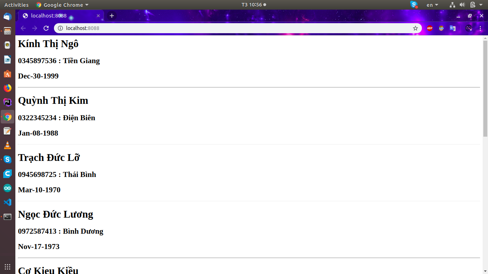

# Fake-name-phone

Faker is a PHP library that generates fake data for you. Whether you need to bootstrap your database, create good-looking XML documents, fill-in your persistence to stress test it, or anonymize data taken from a production service, Faker is for you.

# Table of Contents
- [Installation](#installation)
- [Export](#export)
    - [Name](#1)
    - [Address](#2)
    - [Phone Number](#3)
    - [Birth](#4)

## Installation
 composer require nguyenthang011099/faker-viet-nam
 
 
### Create Fake Class (Example)
    public function __construct()
        {
            $this->Name= new Name();
            $this->Address= new Address();
            $this->Phone= new Phone();
        }
        public function __get($attribute)
        {
            return $this->$attribute->random();
    
        }
### Name
     public function random()
        {
            return $this->firstName[array_rand($this->firstName)]." ".
                   $this->midName[array_rand($this->midName)]." ".
                   $this->lastName[array_rand($this->lastName)]."\n";
    
        }
        
        
    name        //Nguyen Minh Thang
   
### Address
    public function random()
    {
        return $this->province[array_rand($this->province)]."\n";
    }
    address    // Ha Noi
    
### Phone Number
    public function random(){
            return $this->phoneNumber[array_rand($this->phoneNumber)];
        }
     phone     // 0978482834
     
### Birth
     
      public static function random()
    {
        $time =rand( strtotime("Jan 01 1950"), strtotime("Dec 31 2019"));
        return date("M-d-Y", $time);

    }
     
### Web html    
    use Faker\Fake;
    $fake=new Fake();
    ?>
    <?php for ($i=0; $i < 10; $i++): ?>
        <h1><?php echo $fake->Name  ;?></h1>
        <h2><?php echo $fake->Phone." : ".$fake->Address ;?></h2>
         
        <h2><?php echo $fake->Time;?></h2> 
        

    <?php endfor; ?>
     
# Result

